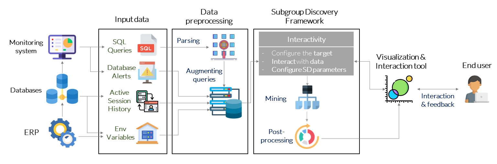
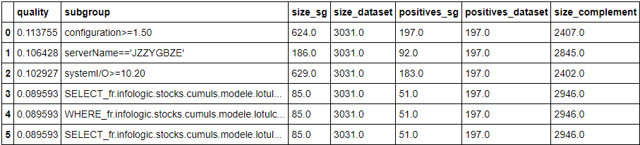
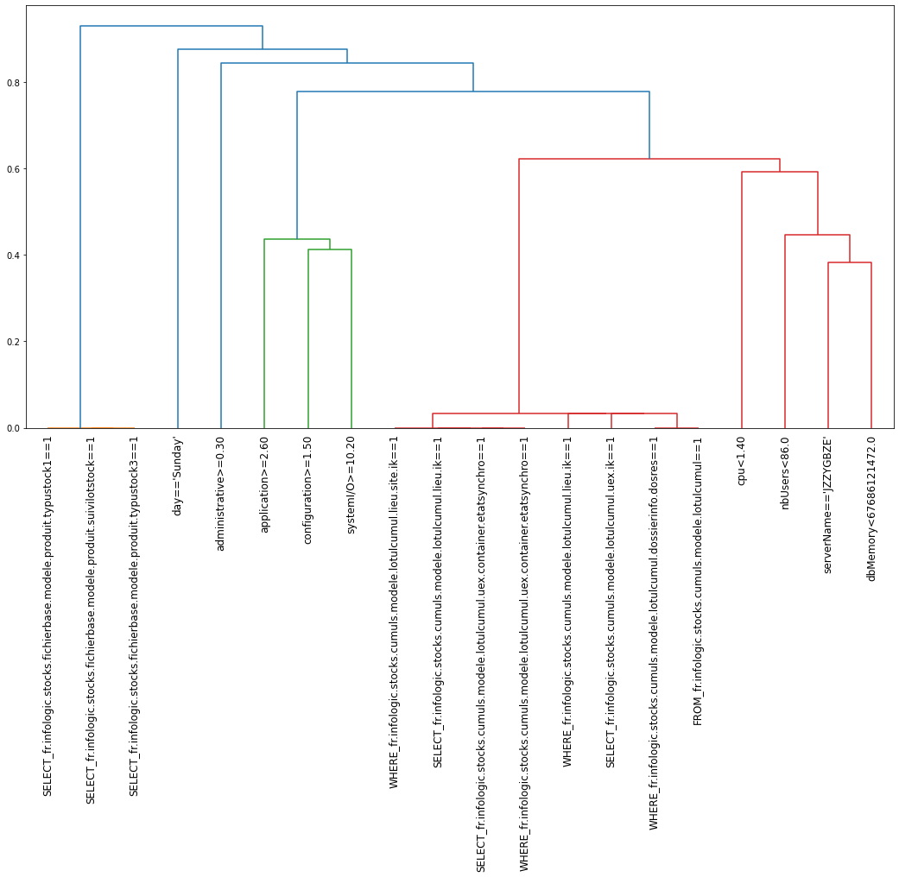
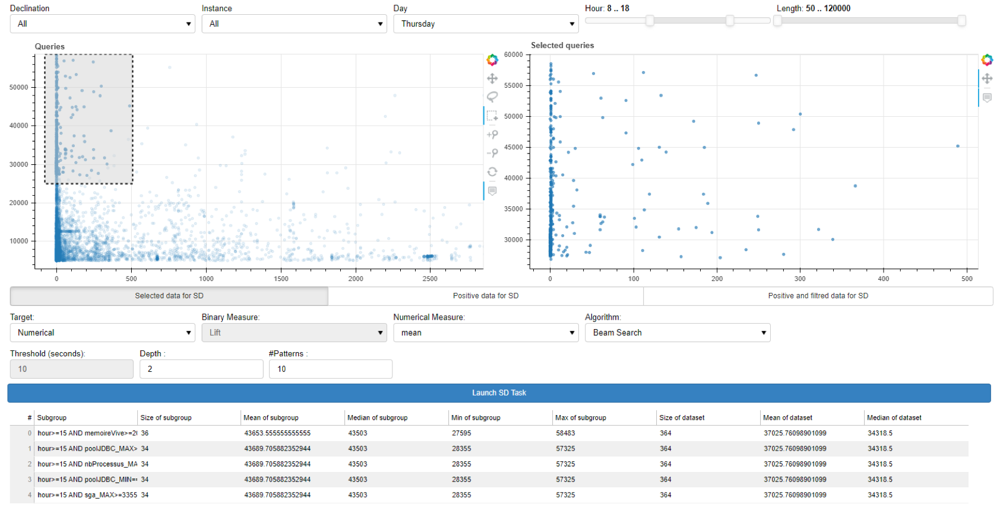

# SD-4SQL: What makes my queries slow?: Subgroup Discovery for SQL Workload Analysis

## OVERVIEW

In this [work](https://www.researchgate.net/publication/353776691_What_makes_my_queries_slow_Subgroup_Discovery_for_SQL_Workload_Analysis) we adressed SQL workload analysis problem to pinpoint schema issues and improve performances. We seek to automatically identify subsets of queries that share some properties only i.e a pattern (e.g., sql clauses and/or environment features) and foster at the same time some target measures, such as execution time or concurrency issues. To this aim we design a generic-framework rooted on a data mining approach known as Subgroup Discovery. This work has been published in the 36th IEEE/ACM International Conferenceon Automated Software Engineering (ASE). For further details, please refer to [our paper](https://www.researchgate.net/publication/353776691_What_makes_my_queries_slow_Subgroup_Discovery_for_SQL_Workload_Analysis).

In this framework we :
- propose a data preprocessing step to _parse_ queries but also augment them with relevant features.
- provide heuristic and exact algorithms to identify relevant subgroups of interest w.r.t a target problem (e.g higher execution time) with a diverse set of interestingness measures.
- integrate a visual tool to enable the user to interact iteratively with the framework.


Our experimental study was conducted on an SQL workload containing _Hibernate_ queries run executed on our clients' servers at [INFOLOGIC](https://www.infologic-copilote.fr/) company. 



## HOW TO USE IT ?
### A. Parsing queries

We use the readily available [Mozilla Parser](https://github.com/mozilla/moz-sql-parser) which provides only an SQL syntactic tree in XML that constitue the input of our customized parser. The syntactic tree is mined using **Depth First stratergy** to identify for each query clause its associated attributes. Moreover, we extended the Mozilla parser in two other ways: 
- considering Hibernate queries used in our ERP as the ORM layer by adding relative keywords for Hibernate such as <tt>JOIN-FETCH</tt>.
- handling nested queries and keeping alias (temporary table names) to differentiate between attributes having same name but which belong to different tables or clauses.

First we need to install the customized parser by executing the following command:

```sh
pip install -e ./Code/extened-mozilla-parser/moz-sql-parser-hack
```
Here is one example:
```python
import os
import sys
from query_parser import parsing

query = 'select count( distinct a.ik) from fr.infologic.ventes.commandesfactures.modele.CdeLig as a where a.cde.typCde = :p1 and a.typLigGenere != :p2 and a.typLigGenere != :p3 and a.art.refDefaut = :p4 and (a.cde.cliLiv = :p5 or 9596436491 in elements (a.cde.noCliContrat)) and ( a.cde.etatContrat in ( :collection0_ ) ) and ( a.etatContrat NOT in ( :collection1_ ) ) and UPPER ( a.libStd ) like UPPER( :p6 ) and a.dossierInfo.dosRes = :p7'

print(parsing(query))
```
```
{'tables_from': ['fr.infologic.ventes.commandesfactures.modele.cdelig'],
 'tables_join': [],
 'projections': ['fr.infologic.ventes.commandesfactures.modele.cdelig.ik'],
 'atts_where': ['fr.infologic.ventes.commandesfactures.modele.cdelig.cde.typcde',
  'fr.infologic.ventes.commandesfactures.modele.cdelig.typliggenere',
  'fr.infologic.ventes.commandesfactures.modele.cdelig.typliggenere',
  'fr.infologic.ventes.commandesfactures.modele.cdelig.art.refdefaut',
  'fr.infologic.ventes.commandesfactures.modele.cdelig.cde.cliliv',
  'fr.infologic.ventes.commandesfactures.modele.cdelig.cde.noclicontrat',
  'fr.infologic.ventes.commandesfactures.modele.cdelig.cde.etatcontrat',
  'fr.infologic.ventes.commandesfactures.modele.cdelig.etatcontrat',
  'fr.infologic.ventes.commandesfactures.modele.cdelig.libstd',
  'fr.infologic.ventes.commandesfactures.modele.cdelig.dossierinfo.dosres'],
 'atts_groupby': [],
 'atts_orderby': [],
 'atts_having': [],
 'functions': ['count']}
 ```
 
 ### B. Subgroup Discovery for SQL Workload Analysis
 
 We show below a simple use case (dataset d-3) considered in the paper:
 ```python
import pandas as pd
from subgroup_discovery import sd_binary_conds
 
queries = pd.read_csv(saved_path + 'dataset-d3.csv')
result_binomial = sd_binary_conds(queries, dict_conds = {},_
                               target = 'conc_disc', 
                               mesure  = 'Binomial',
                               depth  = 1,
                               threshold = 10000, 
                               result_size = 100, 
                               algorithm = 'Beam Search', 
                               beam_width = 100,
                               features_ignore = ['concurrence'])
res_binomial = result_binomial.to_dataframe()
print(res_binamial[:6])
 ```
 
the corresponding results are shown below :




As the framwork does not provide closed patterns, a preprocessing step is more than needed to group patterns having the same extent. We used hierarchical clustering based on the [Jaccard similarity](https://en.wikipedia.org/wiki/Jaccard_index). Here is an example that shows how to perform clustering on the resulting patterns :
 
 ```python
 similarity_dendrogram(result_binomial.to_descriptions(), 20, queries)
 ```


### C. Interactive tool

In practice, an effective SD approach needs to be iterative and interactive, to make it possible to incorporate subjective criteria as well as human expertise. We present our basic interactive took so it can manage different data types, both for input features as well asthe target, including nominal and numerical attributes. It alsoprovides a range of interestingness measures and algorithms.



## HOW TO CITE THIS PAPER AND THE DATASETS

If you are using sd-4sql  or our provided dataset for your research, please consider citing our demo paper:
        
    Y. Remil, A. Bendimerad, R. Mathonat, P. Chaleat, and M. Kaytoue, "what makes my queries slow?": Subgroup discovery for sql workload analysis. in Proceedings of 36th IEEE/ACM  International Conference on Automated Software Engineering (ASE). IEEE, 2021.
    
bibtex:
  
    @inproceedings{remiletalASE21,
      title={"What makes my queries slow?": Subgroup Discovery for SQL workload Analysis},
      author={Remil, Youcef and Bendimerad, Anes and Mathonat, Romain and Chaleat, Philippe and Kaytoue, Mehdi},
      booktitle={Proceedings of 36th IEEE/ACM International Conference on Automated Software Engineering (ASE) (accepted)},
      year={2021},
      organization={IEEE}
    }
